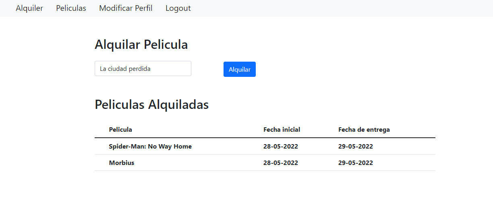

# Frontend_Movies



Este proyecto trata de hacer el frontend de la API ya creada del Backend_Movies

## Comenzando 🚀

Estas instrucciones te permitirán obtener una copia del proyecto en funcionamiento en tu máquina local para propósitos de desarrollo y pruebas.


### Instalación 🔧

* Clona el repositorio a tu maquina local la API
```
git clone https://github.com/Rafael3994/Backend_Movies.git
```
* Clona este repositorio
```
git clone https://github.com/Rafael3994/Frontend_Movies.git
```
* Accedemos a la carpeta e instalamos las dependencias.

```
npm install
```

* Finalmente para iniciar el proyecto ejecuta el comando
```
npm start
```

<br><br>
## Construido con 🛠️

* [JavaScript](https://www.javascript.com/) - Lenguaje de programacion
* [Node.js](https://nodejs.org/es/) - Entorno de ejecucion
* [React](https://es.reactjs.org) - Framework de node para Frontend


## Autores ✒️

* **Rafael Garcia Perez** - [rafael3994](https://github.com/Rafael3994)

## Licencia 📄

Este proyecto está bajo la Licencia.
